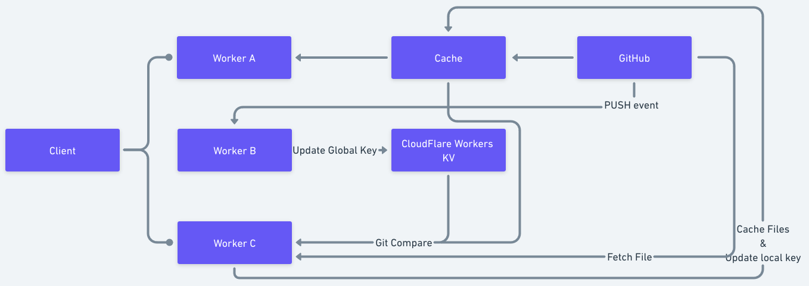

While there's no shortage of platforms for deploying static sites, they all require page building prior to deployment. Adless Games is a platform that enables deployment without the need for building, resulting in swift, effortless deployment.

## Design

In terms of design, Adless Games leverages the power of Git's diff mechanism, ensuring precise updates by comparing global and local keys within the repository. By integrating CloudFlare Workers, an edge computing service, content is fetched directly from GitHub and stored on a CDN for optimal performance.

